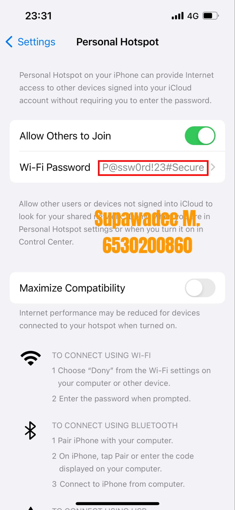

# 🔐 **Security Control**  

### 📷 **ภาพประกอบ:**  
  
 

---

## 🌟 **Type of Security Controls**  

### 🛡️ **Preventative**  
การตั้งรหัสผ่าน Wi-Fi ให้ยากและเปลี่ยนใหม่ทุก 6 เดือน เพื่อป้องกันไม่ให้คนอื่นแอบใช้งานหรือเข้าถึงข้อมูลของคุณ.  

#### ✨ **ตัวอย่างการตั้งรหัส Wi-Fi:**  

- **การตั้งรหัสผ่านที่ยาก**  
  การใช้รหัสผ่านที่ประกอบด้วยตัวอักษร, ตัวเลข, และอักขระพิเศษ เช่น:  
  `P@ssw0rd!23#Secure`  
  เพื่อให้ยากต่อการคาดเดาหรือถอดรหัสจากผู้ไม่ประสงค์ดี ซึ่งช่วยเพิ่มความปลอดภัยในการใช้งานอินเทอร์เน็ตในบ้านหรือที่ทำงาน.  

- **การเปลี่ยนรหัสทุก 6 เดือน**  
  การเปลี่ยนรหัสผ่านเป็นระยะ ๆ ช่วยลดความเสี่ยงจากการที่รหัสผ่านอาจรั่วไหลออกไปหรือถูกแฮ็กในช่วงเวลานาน ๆ.  
  👉 **คำแนะนำ:** ตั้งเตือนในโทรศัพท์ 📱 หรือปฏิทิน 📅 เพื่อช่วยเตือนให้อัปเดตรหัสผ่านตรงเวลา.  

---

### 📍 **Location**  
🏠 **My Dormitory**  
